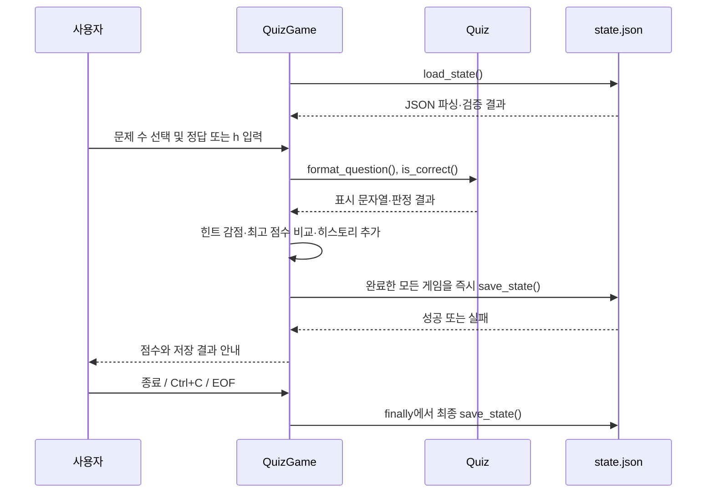
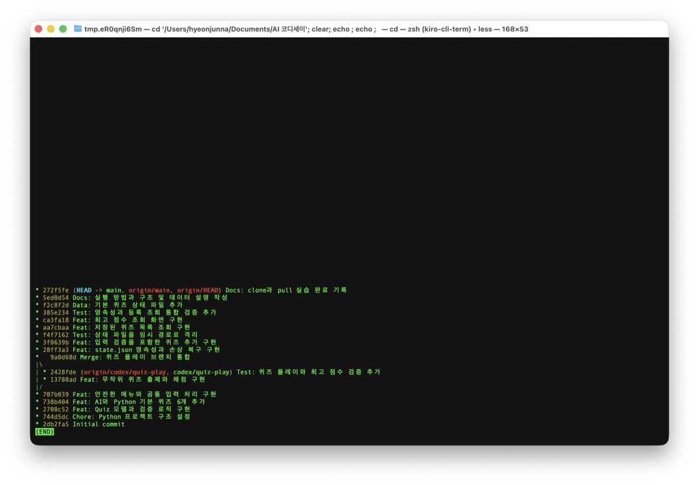

# 🤖 AI 탐험 퀴즈 게임

Python 기본 문법, 객체 지향, JSON 파일 입출력, Git 워크플로우를 한 번에
연습하기 위해 만든 터미널 퀴즈 게임입니다. 프로그램을 종료한 뒤 다시
실행해도 사용자가 추가·삭제한 퀴즈, 최고 점수와 모든 게임 기록이
`state.json`에 유지됩니다.

- GitHub 저장소: [vivleon/ia-codyssey-2](https://github.com/vivleon/ia-codyssey-2)
- 기본 브랜치: `main`
- 기본 퀴즈: AI와 Python 기초 18개
- 필수 실행 환경: Python 3.10 이상
- 외부 라이브러리: 없음

동료평가에서는 이 문서의 **13. 평가 문항별 즉답 가이드**를 먼저 열면
사진에 제시된 항목 1~4의 질문에 대한 짧은 답변과 코드 근거를 바로 확인할
수 있습니다.

## 1. 퀴즈 주제와 선정 이유

주제는 **AI와 Python 기초**입니다. AI를 사용할 때 필요한 기본 개념과
검증 태도를 익히는 동시에, 이 프로그램을 구성하는 Python 문법도 함께
복습할 수 있어 선정했습니다. 직접 작성한 기본 퀴즈 18개가 포함되어
있습니다.

## 2. 실행 방법과 메뉴 안내

```bash
git clone https://github.com/vivleon/ia-codyssey-2.git
cd ia-codyssey-2
python3 --version
python3 main.py
```

메뉴에서 `1`부터 `6`까지 원하는 기능의 번호를 입력합니다.

```text
1. 퀴즈 풀기   - 문제 수를 선택하고 무작위 순서로 풀며 힌트를 사용할 수 있습니다.
2. 퀴즈 추가   - 문제, 서로 다른 선택지 4개, 정답 번호와 힌트를 등록합니다.
3. 퀴즈 목록   - 저장된 문제와 선택지, 정답, 힌트를 확인합니다.
4. 점수 확인   - 최고 점수와 날짜·시간이 포함된 모든 게임 기록을 확인합니다.
5. 퀴즈 삭제   - 번호로 선택한 문제를 삭제하고 즉시 저장합니다.
6. 종료        - 현재 상태를 저장한 뒤 프로그램을 종료합니다.
```

숫자 메뉴에서는 앞뒤 공백을 제거한 뒤 입력을 검사합니다. 잘못 입력해도
프로그램이 종료되지 않고 같은 입력 단계로 돌아옵니다.

| 입력 상황 | 사용자 안내 문구 | 처리 |
| --- | --- | --- |
| 빈 입력 | `값을 입력해 주세요.` | 같은 항목 재입력 |
| 숫자가 아닌 입력 | `숫자로 입력해 주세요.` | 같은 항목 재입력 |
| 허용 범위 밖 숫자 | 현재 입력 단계의 허용 범위를 안내 | 같은 항목 재입력 |
| 빈 문제 또는 선택지 | `내용을 입력해 주세요.` | 같은 항목 재입력 |
| 중복 선택지 | `이미 입력한 선택지입니다. 다른 내용을 입력해 주세요.` | 해당 선택지 재입력 |
| 정답 입력에서 `h` | 해당 문제의 힌트 표시 | 같은 문제의 정답 입력 계속 |
| `Ctrl+C` 또는 EOF | `입력이 중단되었습니다. 안전하게 종료합니다.` | 가능한 상태 저장 후 종료 |

입력 예시는 다음과 같습니다.

| 예시 입력 | 판정 |
| --- | --- |
| `1` 또는 앞뒤 공백이 있는 ` 3 ` | 정상 입력으로 처리 |
| `abc` | 숫자가 아니므로 안내 후 재입력 |
| 메뉴에서 `9` | 허용 범위 밖이므로 안내 후 재입력 |
| 아무것도 쓰지 않고 Enter | 빈 입력이므로 안내 후 재입력 |

메뉴에는 `1`부터 `6`, 퀴즈 정답에는 `1`부터 `4` 또는 힌트 요청 `h`를
입력합니다. 퀴즈를 시작하면 먼저 `1`부터 현재 저장된 문제 수 사이에서
풀 문제 수를 고릅니다. 현재 입력 단계에서 별도의 취소 문자는 제공하지
않으며, 메인 메뉴의 `6`으로
정상 종료하거나 `Ctrl+C`로 안전 종료할 수 있습니다. 재시도 횟수를 제한하지
않는 이유는 초보 학습자가 입력 실수 때문에 게임에서 강제로 퇴장하지 않게
하기 위해서입니다.

자동 테스트는 다음 명령으로 실행합니다.

```bash
python3 -m unittest discover -v
```

2026-08-13 기준 자동 테스트 34개가 모두 통과합니다. 메뉴 출력,
입력·정답 경계값, 무작위 출제, 문제 수 선택, 힌트 감점, 삭제 영속성,
전체 점수 기록과 기존 JSON 호환성까지 회귀 테스트로 검증합니다.

## 3. 기능 목록

- 기본 AI·Python 퀴즈 18개 제공
- 퀴즈 풀기·추가·목록·점수 확인·삭제·종료 메뉴 제공
- 정답·오답 판정과 빈 값·문자·범위 밖 입력 재시도
- 퀴즈·최고 점수·전체 게임 기록의 JSON 영속화
- `Ctrl+C`와 입력 스트림 종료 시 현재 상태 저장 후 안전 종료
- 손상 파일 백업·복구와 UTF-8 원자적 저장

### 3.1 보너스 과제 충족표

| 보너스 항목 | 구현·설명 요점 | 대표 자동 테스트 |
| --- | --- | --- |
| 랜덤 출제 | 복사한 목록을 `random.shuffle()`로 섞어 원본 순서를 보호 | `test_questions_are_shuffled_before_selection` |
| 문제 수 선택 | `1`~저장 문제 수를 입력받아 섞인 목록을 슬라이싱 | `test_player_selects_question_count` |
| 힌트 기능 | `Quiz.hint`, 입력 `h`, 문제당 1회, 1회당 10점 차감 | `test_hint_is_shown_once_and_deducts_ten_points` |
| 퀴즈 삭제 | 번호로 삭제하고 저장 실패 시 원래 위치로 되돌림 | `test_delete_quiz_rolls_back_when_save_fails` |
| 점수 히스토리 | 모든 게임의 ISO 시각·문제·정답·힌트·점수를 즉시 저장 | `test_every_completed_game_is_saved_to_history` |

## 4. 파일 구조

```text
.
├── main.py                    # 프로그램 시작점
├── quiz.py                    # Quiz 클래스와 데이터 변환
├── quiz_game.py               # QuizGame 클래스와 전체 게임 흐름
├── defaults.py                # 힌트를 포함한 기본 퀴즈 18개
├── state.json                 # 퀴즈, 최고 점수, 전체 게임 기록
├── docs/
│   ├── git-evidence.txt       # 원격 URL, 커밋 수, 브랜치 그래프 증빙
│   ├── state-benchmark.md     # JSON 크기별 저장·로드 측정 결과
│   └── screenshots/           # 실행 및 Git 증빙 이미지
├── scripts/
│   └── benchmark_state.py    # 상태 벤치마크 재현 스크립트
├── tests/
│   ├── test_quiz.py           # Quiz 모델 테스트
│   ├── test_menu.py           # 메뉴와 공통 입력 테스트
│   ├── test_play.py           # 출제와 채점 테스트
│   └── test_game_features.py  # 저장, 복구, 등록, 조회 통합 테스트
├── .gitignore
└── README.md
```

## 5. 클래스와 메서드 책임

### 5.1 `Quiz`

`Quiz`는 한 문제의 데이터와 그 데이터에 직접 관련된 동작을 담당합니다.

| 속성·메서드 | 책임 |
| --- | --- |
| `question`, `choices`, `answer`, `hint` | 문제, 선택지 4개, 정답 번호와 힌트 보관 |
| `__post_init__()` | 빈 값, 선택지 개수·중복, 정답 범위, 힌트 검증 |
| `format_question()` | 터미널에 표시할 문제 문자열 생성 |
| `is_correct()` | 사용자가 고른 번호와 정답 비교 |
| `to_dict()` | JSON 저장이 가능한 사전으로 변환 |
| `from_dict()` | JSON에서 읽은 사전으로 `Quiz` 복원 |

### 5.2 `QuizGame`

`QuizGame`은 여러 퀴즈와 사용자 상호작용, 점수, 영속화를 관리합니다.

| 속성·메서드 | 책임 |
| --- | --- |
| `__init__()` | 입출력 함수, 무작위 함수, 상태 경로 설정 후 상태 로드 |
| `run()` | 메뉴 반복, 기능 호출, 안전 종료와 최종 저장 |
| `_read_int()` | 정수 변환과 허용 범위 검증 |
| `_read_non_empty()` | 공백이 아닌 문자열 입력 보장 |
| `_read_answer_with_hint()` | 정답 또는 `h` 입력, 문제당 힌트 1회 처리 |
| `play_quiz()` | 문제 수 선택, 무작위 출제, 힌트 감점, 점수·기록 저장 |
| `add_quiz()` | 새 퀴즈 입력·검증·저장 |
| `list_quizzes()` | 저장된 퀴즈 목록 출력 |
| `delete_quiz()` | 번호로 퀴즈 삭제 후 즉시 저장 |
| `show_best_score()` | 최고 점수와 모든 게임 기록 출력 |
| `load_state()` | 파일 읽기, 스키마 검증, 객체 복원, 손상 복구 |
| `_validate_score_history()` | 게임 기록의 시간·타입·범위 검증 |
| `_backup_invalid_state()` | 손상 파일의 버전 백업 생성과 보관 개수 제한 |
| `save_state()` | 임시 파일을 이용한 UTF-8 JSON 원자적 저장 |

### 5.3 클래스 사용 이유

함수만 사용하면 퀴즈 데이터와 전체 게임 상태를 여러 인자로 계속 전달해야
합니다. `Quiz`와 `QuizGame`으로 나누면 데이터와 동작이 함께 묶이고,
문제 검증과 게임 흐름을 독립적으로 테스트할 수 있습니다. 예를 들어 정답
판정 변경은 `Quiz.is_correct()`에, 최고 점수 변경은
`QuizGame._is_new_best()`에 집중되어 유지보수 범위가 분명합니다.

클래스 방식은 관련 상태와 동작을 묶어 테스트·확장하기 쉽다는 장점이 있지만,
작은 계산 하나에도 클래스 구조를 만들면 함수 방식보다 코드와 초기화 절차가
늘어날 수 있습니다. 상태가 필요 없는 순수 계산은 함수가 단순하고, 여러
메서드가 공유하는 퀴즈 목록·점수·파일 경로처럼 수명주기가 있는 상태는
클래스가 적합하다는 기준으로 나눴습니다.

| 비교 기준 | 함수 중심 | 클래스 중심 | 이 프로젝트의 선택 |
| --- | --- | --- | --- |
| 상태 | 인자·반환값으로 명시적 전달 | 인스턴스가 공유 상태 보관 | 퀴즈 목록·점수·경로는 `QuizGame` |
| 간결성 | 작은 무상태 계산에 유리 | 초기화와 생명주기 관리 필요 | 기본 데이터 생성은 함수 |
| 테스트 | 순수 함수는 독립 검증이 쉬움 | 입출력·섞기 함수 교체 가능 | 생성자 주입으로 게임 흐름 검증 |
| 확장 | 상태 인자가 늘어날 수 있음 | 책임 경계가 흐려지면 비대해질 수 있음 | `Quiz`와 `QuizGame`으로 경계 분리 |

### 5.4 책임 경계 사례

| 상황 | 담당 클래스 | 이유 |
| --- | --- | --- |
| 정답 번호가 1부터 4인지 검사 | `Quiz` | 한 문제 자체가 항상 유효해야 하는 규칙 |
| 사용자에게 정답 번호를 다시 입력받기 | `QuizGame` | 콘솔 입력 흐름에 관한 책임 |
| 선택한 번호가 정답인지 판단 | `Quiz` | 한 문제의 데이터와 직접 관련된 동작 |
| 여러 문제의 정답 수와 최고 점수 계산 | `QuizGame` | 게임 전체 상태를 종합하는 동작 |
| 퀴즈 한 개를 사전으로 변환 | `Quiz` | 개별 모델 직렬화 |
| 전체 목록과 점수를 파일에 저장 | `QuizGame` | 애플리케이션 수준 영속화 |

이 경계를 유지하면 화면이나 저장 방식이 바뀌어도 개별 문제의 정답 판정은
영향을 덜 받고, 선택지 규칙이 바뀌면 `Quiz`와 관련 테스트부터 확인할 수
있습니다.

### 5.5 파일·함수별 실행 책임 매핑

| 실행 책임 | 파일과 함수·메서드 |
| --- | --- |
| 프로그램 시작 | `main.py: main()` |
| 메뉴 선택과 종료 | `quiz_game.py: QuizGame.run()` |
| 정수·문자열 입력 검증 | `quiz_game.py: _read_int()`, `_read_non_empty()` |
| 출제·채점·최고 점수 | `quiz_game.py: play_quiz()`, `_is_new_best()` |
| 퀴즈 등록·조회·삭제 | `quiz_game.py: add_quiz()`, `list_quizzes()`, `delete_quiz()` |
| 개별 문제 검증·판정 | `quiz.py: Quiz.__post_init__()`, `is_correct()` |
| JSON 변환 | `quiz.py: to_dict()`, `from_dict()` |
| 상태 로드·백업·저장 | `quiz_game.py: load_state()`, `_backup_invalid_state()`, `save_state()` |

주요 책임과 회귀 테스트의 연결은 다음과 같습니다.

| 책임 | 대표 테스트 |
| --- | --- |
| 메뉴 출력·종료 | [`test_menu_output_matches_the_six_documented_options`](tests/test_menu.py) |
| 정수 범위 검증 | [`test_integer_input_accepts_minimum_and_maximum_boundaries`](tests/test_menu.py) |
| 정답 판정 | [`test_accepts_first_and_last_answer_boundaries`](tests/test_quiz.py) |
| 최고 점수 갱신·저장 | [`test_new_best_score_is_saved_immediately`](tests/test_play.py) |
| 저장 실패 안내 | [`test_new_best_score_reports_immediate_save_failure`](tests/test_play.py) |
| 손상 파일 백업·복구 | [`test_corrupted_state_recovers_and_rewrites_valid_json`](tests/test_game_features.py) |
| 랜덤 출제·문제 수 선택 | `test_questions_are_shuffled_before_selection`, `test_player_selects_question_count` |
| 힌트 감점·게임 기록 | `test_hint_is_shown_once_and_deducts_ten_points`, `test_every_completed_game_is_saved_to_history` |
| 퀴즈 삭제 영속성 | `test_delete_quiz_persists_after_reload` |

## 6. 프로그램 호출 흐름

```text
main.py
└─ QuizGame 생성
   └─ load_state
      ├─ state.json 없음 → 기본 퀴즈 18개 사용
      ├─ 정상 파일 → v1/v2 스키마 검증 → Quiz·점수·기록 복원
      └─ 손상 파일 → 버전 백업 → 기본 퀴즈 18개 복구 → save_state

QuizGame.run
├─ 메뉴 입력 검증
├─ play_quiz → 문제 수 선택 → shuffle → 힌트·채점 → 기록 저장
├─ add_quiz / list_quizzes / delete_quiz
├─ show_best_score → 최고 점수와 전체 게임 기록
└─ 정상 종료·Ctrl+C·EOF
   └─ finally → save_state
```



현재 프로그램은 네트워크 연결, 데이터베이스 연결, 별도 로그 파일 같은 외부
자원을 열지 않으므로 종료 시 핵심 정리 항목은 상태 저장입니다. 나중에 이런
자원을 추가하면 같은 `finally` 구간에서 연결과 파일을 닫아야 합니다.
예를 들어 네트워크 클라이언트가 추가되면 다음과 같이 상태 저장과 자원
해제를 하나의 종료 경로에 둡니다. 아래는 미래 확장용 예시이며 현재 코드에
네트워크 연결이 있다는 뜻은 아닙니다.

```python
client = None
try:
    client = create_client()
    run_game(client)
finally:
    if client is not None:
        client.close()
    game.save_state()
```

현재 미션의 대화형 실행에서는 사용자가 발생시키는 `Ctrl+C`와 EOF를 처리합니다.
서버나 컨테이너에서 장시간 실행하는 프로그램으로 바뀐다면 `SIGTERM` 같은 외부
종료 신호도 안전 종료 요청으로 변환하고, 신호 처리기 자체에서는 복잡한 파일
작업을 하지 않고 기존 종료·저장 흐름이 실행되도록 설계해야 합니다.

## 7. 데이터 파일과 영속성

### 7.1 상태 파일 위치

기본 상태 파일은 `quiz_game.py`와 같은 프로젝트 루트의 `state.json`입니다.
테스트나 다른 프로그램에서 사용할 때는 생성자 인자로 별도 경로를 지정할
수 있습니다. 이는 명령행 옵션이 아니라 Python 코드에서 사용하는 설정입니다.

```python
from pathlib import Path

from quiz_game import QuizGame

game = QuizGame(state_file=Path("/temporary/path/state.json"))
```

테스트는 이 기능을 사용해 실제 `state.json`을 변경하지 않고 임시 폴더에서
파일 저장과 복구를 검증합니다.

### 7.2 JSON을 선택한 이유

JSON은 사람이 직접 읽고 수정하기 쉬운 텍스트 형식이고 Python의 `dict`,
`list`, `str`, `int`와 자연스럽게 대응합니다. 작은 콘솔 프로젝트에서는
별도 데이터베이스 설치 없이 사용할 수 있어 가볍고, UTF-8과 함께 사용하면
한글 문제도 그대로 보존할 수 있습니다. 반면 데이터가 커지면 전체 파일을
읽고 다시 써야 하므로 대규모 검색이나 동시 수정에는 적합하지 않습니다.

- 장점: 높은 가독성, 가벼운 파일 형식, 표준 라이브러리 지원, 쉬운 이식성
- 단점: 부분 조회·부분 수정이 어렵고, 인덱스·트랜잭션·동시 쓰기를 지원하지 않음

따라서 JSON의 **가독성과 경량성**은 현재 학습 규모에 적합하지만, 데이터가
커질 때는 데이터베이스 전환을 검토해야 합니다.

### 7.3 스키마

```json
{
  "schema_version": 2,
  "quizzes": [
    {
      "question": "문제 내용",
      "choices": ["선택지 1", "선택지 2", "선택지 3", "선택지 4"],
      "answer": 2,
      "hint": "정답을 직접 말하지 않는 도움말"
    }
  ],
  "best_score": {
    "correct": 4,
    "total": 6,
    "percentage": 57,
    "hints_used": 1
  },
  "score_history": [
    {
      "played_at": "2026-08-13T10:00:00+09:00",
      "correct": 4,
      "total": 6,
      "hints_used": 1,
      "percentage": 57
    }
  ]
}
```

| 필드 | 필수 여부 | 의도와 검증 규칙 |
| --- | --- | --- |
| `schema_version` | v2 저장 시 필수 | 현재 형식은 2, 필드가 없는 이전 파일은 v1로 읽음 |
| `quizzes` | 필수 | 퀴즈 객체 목록이며, 각 항목은 `Quiz.from_dict()`로 검증 |
| `question` | 필수 | 공백이 아닌 문제 문자열 |
| `choices` | 필수 | 비어 있지 않고 서로 다른 문자열 정확히 4개 |
| `answer` | 필수 | 1부터 4 사이의 정수 |
| `hint` | v2 필수 | 공백이 아닌 문자열, v1에서 없으면 `힌트가 없습니다.` 사용 |
| `best_score` | 선택 | 없거나 아직 플레이하지 않았으면 `null`, 아니면 점수 객체 |
| `score_history` | v2 필수 | 완료한 모든 게임 기록, v1에서 없으면 빈 목록 사용 |
| `played_at` | 기록에서 필수 | 시간대가 포함된 ISO 8601 날짜·시간 |
| `correct` | 점수 객체에서 필수 | 0 이상이고 `total` 이하인 정답 수 |
| `total` | 점수 객체에서 필수 | 1 이상의 전체 문제 수 |
| `percentage` | 점수 객체에서 필수 | 0부터 100 사이의 정수 점수 |
| `hints_used` | v2 점수·기록에서 필수 | 0부터 푼 문제 수 사이의 힌트 사용 횟수 |

현재는 힌트와 점수 히스토리를 추가한 v2입니다. `schema_version`, `hint`,
`score_history`가 없는 기존 파일은 v1으로 보고, 힌트에는 호환 기본값을,
히스토리에는 빈 목록을 적용합니다. 다음 저장부터 v2 형식으로 기록됩니다.
지원하지 않는 미래 버전은 손상 데이터로 취급해 기존 백업·복구 정책을
적용합니다. `test_old_state_without_new_fields_remains_compatible`가 v1 호환을
검증합니다.

### 7.4 읽기, 저장, 복구 순서

읽을 때는 파일 존재 확인, JSON 파싱, 최상위 객체 확인, `quizzes` 목록 확인,
버전 확인, 각 퀴즈 검증, 최고 점수 검증, 전체 게임 기록 검증 순서로
진행합니다. 모든 검증을 통과한 데이터만 현재 상태로 사용합니다.

저장할 때는 현재 객체를 사전으로 변환하고 같은 폴더의 임시 파일에 UTF-8로
전부 기록한 다음 `state.json`으로 교체합니다. 저장 도중 중단되어 원본이
일부만 기록될 위험을 줄이는 원자적 저장 방식입니다.

정상 로드와 최고 점수 즉시 저장의 예시 로그는 다음과 같습니다.

```text
[시작] state.json 확인 → v1/v2 파싱 → quizzes/best_score/score_history 검증
[완료] 게임 기록 추가 → 최고 점수 비교 → .state.json.tmp 전체 기록
[교체] 임시 파일 → state.json 원자적 교체 → 저장 결과 안내
```

오류 메시지는 `[문제] + [대상] + [복구 행동]`의 순서로 안내합니다.
예를 들어 저장 실패 시 ① `상태 파일을 저장하지 못했습니다: <원인>`,
② `저장 대상: <경로>`, ③ `임시 파일이 남아 있다면 내용을 확인하세요:
<경로>`를 순서대로 출력해 문제와 대응 방법을 같이 전달합니다.

| 예외·오류 | 대응 |
| --- | --- |
| 파일 없음 | 기본 퀴즈 18개, 미응시 점수와 빈 히스토리 사용 |
| JSON 문법 오류 | 손상 파일을 백업한 뒤 기본 데이터로 복구하고 정상 JSON 재작성 |
| 타입·범위·스키마 오류 | 잘못된 상태를 백업하고 기본 데이터로 복구 |
| 읽기 운영체제 오류 | 원인을 안내하고 가능한 경우 원본 백업 후 복구 시도 |
| 쓰기 운영체제 오류 | 오류, 저장 대상, 임시 파일 경로와 확인 방법 안내 |
| `KeyboardInterrupt`, `EOFError` | 실행 루프를 끝내고 `finally`에서 저장 시도 |

기본 데이터 복구는 프로그램 실행 가능성을 우선한 정책입니다. 손상된 원본은
`state.json.broken-날짜.bak` 형식으로 같은 폴더에 보관하며, 오래된 파일이
무한히 늘지 않도록 최근 3개만 유지합니다. 저장 실패 시에는 임시 파일 내용을
확인하고 디스크 여유 공간과 폴더 쓰기 권한을 해결한 뒤 다시 실행합니다.
권한 부족과 디스크 부족은 같은 상태에서 즉시 반복해도 해결되지 않으므로 자동
재시도하지 않고, 원인을 해결한 사용자가 다시 저장하도록 안내합니다.

개인용 로컬 백업은 위 정책으로 충분하지만 중요한 데이터라면 프로젝트 폴더
밖의 사용자 백업 디렉터리나 암호화된 클라우드 저장소에 정기 복사해야 합니다.
자격 증명이나 개인정보가 들어간 상태 파일은 공개 Git 저장소에 백업하지 않습니다.

복구 후에는 다음 무결성 체크리스트를 확인합니다.

- 안내 메시지에 원인과 `state.json.broken-날짜.bak` 경로가 보이는지
- 백업 파일의 내용이 손상된 원본과 같고, 최대 3개만 남았는지
- 새 `state.json`이 유효한 UTF-8 JSON이고 기본 퀴즈가 18개인지
- 프로그램을 재실행해 복구된 파일이 다시 정상 로드되는지
- `python3 -m unittest tests.test_game_features -v`가 통과하는지

## 8. Git과 GitHub 수행 증빙

### 8.1 원격 저장소와 커밋 수

검증일: 2026-08-13, 보너스 기능 게시 후 스냅샷

```text
$ git remote get-url origin
https://github.com/vivleon/ia-codyssey-2.git

$ git rev-list --count HEAD
24
```

이번 README 정리 커밋 게시 후 로컬·원격 `main`에는 의미 있는 커밋 24개가
있어 최소 기준 10개 이상을 충족합니다. 최신 상태는 위 명령으로 확인하고,
초기 분기·병합 증빙은
[Git 원격·커밋 증빙](docs/git-evidence.txt)에서 확인합니다.

### 8.2 브랜치와 병합

브랜치는 안정적인 `main`에 영향을 주지 않고 기능을 독립적으로 개발하고
검증하기 위해 사용합니다. 병합은 별도 브랜치에서 검증이 끝난 변경 이력을
대상 브랜치에 통합하는 과정입니다. 이 프로젝트는 `--no-ff` 병합을 사용해
어떤 커밋들이 퀴즈 플레이 기능 브랜치에서 만들어졌는지 기록을 보존했습니다.

```bash
git checkout main
git merge --no-ff codex/quiz-play -m "Merge: 퀴즈 플레이 브랜치 통합"
```

- `codex/quiz-play` 브랜치에서 출제·채점 기능과 테스트 구현
- `main`에 `--no-ff` 방식으로 병합해 브랜치 작업 기록 보존
- 개발 완료 후 별도 디렉터리에서 clone → 수정 → commit → push 수행
- 기존 작업 디렉터리에서 pull하여 원격 변경 반영

팀 작업의 브랜치 이름은 `<type>/<short-topic>` 형식을 권장합니다. type은
`feature`, `fix`, `docs`, `test`, `chore`를 사용하고, topic은 소문자
영문·숫자·하이픈으로 간결하게 적습니다. 예: `test/score-save-log`.

병합 충돌이 발생하면 `git status`로 충돌 파일을 확인하고, 파일 안의 충돌
표시를 비교해 의도한 내용을 남깁니다. 테스트 후 `git add`와 `git commit`으로
병합을 완료하며, 해결 내용을 이해하지 못한 상태에서 강제로 덮어쓰지 않습니다.

### 8.3 커밋 메시지 규칙

기존 이력은 `Type: 변경 요약` 형식을 사용했습니다. 앞으로 영역까지 필요한
변경에는 `Type(Scope): 변경 요약` 템플릿을 사용합니다. 한 커밋에는 하나의
기능 또는 목적을 담고, 무엇이 바뀌었는지 알 수 있는 명령형 요약을 씁니다.

```text
Type(Scope): 50자 안팎의 변경 요약

- 변경 이유 또는 중요한 구현 판단
- 관련 테스트와 검증 결과
```

예: `Docs(readme): 사전평가 Git 증빙과 확장성 분석 보강`

| Type | 사용 목적 | 예시 |
| --- | --- | --- |
| `Feat` | 사용자 기능 추가 | `Feat: 무작위 퀴즈 출제와 채점 구현` |
| `Fix` | 오류 수정 | `Fix: 손상된 상태 파일 복구 오류 수정` |
| `Test` | 테스트 추가·수정 | `Test: 최고 점수 갱신 검증 추가` |
| `Docs` | 문서와 증빙 변경 | `Docs: Git 원격과 커밋 수 증빙 추가` |
| `Refactor` | 동작을 유지한 구조 개선 | `Refactor: QuizGame 저장 책임 분리` |
| `Data` | 기본 데이터 변경 | `Data: AI 기초 퀴즈 추가` |
| `Chore` | 설정과 프로젝트 정리 | `Chore: Python 프로젝트 구조 설정` |

scope는 선택이므로 `Type: 요약`과 `Type(Scope): 요약`은 모두 규칙을
준수합니다. 실제 예시는 `git log --oneline`에서 확인하며, 커밋 전에는
`git diff --cached`, 커밋 후에는 `git log -1 --pretty=%s`로 점검합니다.

### 8.4 주요 Git 명령

| 명령 | 역할 |
| --- | --- |
| `git init` | 현재 폴더에 새 로컬 저장소 생성 |
| `git add` | 다음 커밋에 포함할 변경 선택 |
| `git commit` | 선택한 변경을 하나의 이력으로 기록 |
| `git push` | 로컬 커밋을 원격 저장소에 전송 |
| `git pull` | 원격 변경을 가져와 현재 브랜치에 통합 |
| `git checkout` | 브랜치를 만들거나 전환 |
| `git clone` | 원격 저장소 전체를 새 로컬 폴더에 복제 |

## 9. 1,000개 이상 퀴즈의 성능·메모리·검색 한계 분석

현재 구조는 실행할 때 전체 JSON을 메모리에 읽고, 저장할 때 전체 JSON을
다시 기록합니다. 퀴즈 목록 출력과 특정 내용을 찾는 작업은 모든 항목을
차례로 확인하므로 O(N), 무작위 출제를 위한 목록 복사와 섞기도 O(N)입니다.
1,000개 정도는 일반적인 개인용 환경에서 동작할 수 있지만, 데이터가 계속
늘면 시작·저장 시간과 메모리 사용량이 데이터 크기에 비례해 증가합니다.

| 한계 | 현재 방식 | 확장 대안 |
| --- | --- | --- |
| ID로 한 문제 찾기 | 목록 순차 탐색 O(N) | ID를 키로 한 `dict` 인덱스 |
| 제목·카테고리 검색 | 매번 전체 목록 검사 | 검색어·카테고리 인덱스와 페이지네이션 |
| 한 문제만 수정 | 전체 JSON 다시 저장 | SQLite 행 단위 추가·수정 |
| 여러 프로세스 동시 저장 | 마지막 저장이 앞선 변경을 덮을 수 있음 | SQLite 트랜잭션과 잠금 |
| 메모리 사용 | 모든 퀴즈를 한 번에 로드 | 페이지 단위 조회와 필요한 데이터만 로드 |
| 스키마 변경 | 수동 기본값·검증 필요 | `schema_version`과 마이그레이션 절차 |

확장 순서는 먼저 각 퀴즈에 고유 ID와 카테고리를 추가하고 메모리 인덱스를
구성한 뒤, 실제 시작·검색·저장 시간이 사용자 기준을 넘거나 동시 수정이
필요해질 때 SQLite로 전환하는 방식이 적절합니다. 전환 전후에는 같은 데이터로
시작 시간, 검색 시간, 저장 시간, 메모리 사용량을 측정해 판단해야 합니다.

요약하면 1,000개 이상에서는 인덱스 없는 O(N) 검색, 전체 파일 재저장,
전체 메모리 로드가 주요 한계입니다. 고유 ID 인덱스와 페이지네이션을 먼저
적용하고, 부분 수정·동시성·지속적인 증가가 필요하면 JSON 파일 대신 SQLite
같은 데이터베이스를 사용합니다.

재현 가능한 측정 결과와 100ms·10MiB 전환 검토 기준은
[JSON 상태 벤치마크](docs/state-benchmark.md)에 있습니다. 2026-08-13
Apple Silicon Mac·Python 3.9.6에서 v2 스키마를 11회 측정한 중앙값과 p95로
1,000개는
약 255.9KiB, 저장 6.66ms(p95 7.53ms), 로드 9.42ms(p95 9.90ms),
로드 피크 1.28MiB였습니다.

## 10. 요구 변경 시 수정 위치

| 요구 변경 | 주요 수정 파일·함수 | 함께 확인할 테스트 |
| --- | --- | --- |
| 정답 판정 규칙 변경 | `quiz.py`의 `is_correct()` | `tests/test_quiz.py` |
| 선택지 수 변경 | `Quiz.__post_init__()`, 입력·표시 로직, JSON 스키마 | 모델·등록·플레이 테스트 |
| 점수 계산 변경 | `play_quiz()`, `_is_new_best()` | `test_all_correct_answers_set_best_score`, `test_lower_score_does_not_replace_best` |
| 힌트 감점 변경 | `HINT_PENALTY`, `_read_answer_with_hint()`, `play_quiz()` | `test_hint_is_shown_once_and_deducts_ten_points` |
| 메뉴 기능 추가 | `MENU`, `run()`의 `actions` | `tests/test_menu.py` |
| 새 저장 필드 추가 | `to_dict()`, `from_dict()`, `load_state()`, `save_state()` | `test_save_and_reload_preserves_quizzes_and_score`와 손상 복구 테스트 |
| 게임 기록 구조 변경 | `_validate_score_history()`, `play_quiz()`, `show_best_score()` | `test_every_completed_game_is_saved_to_history` |
| 백업 정책 추가 | `_backup_invalid_state()`, `save_state()` | `tests/test_game_features.py`의 백업·저장 테스트 |
| 검색 기능 추가 | `QuizGame`의 검색 메서드와 인덱스 | 신규 검색 테스트 |

변경 전에 `python3 -m unittest discover -v`로 기준선을 확보하고, 표의
관련 테스트를 우선 실행한 뒤 전체 테스트를 다시 실행합니다. 파이썬
표준 라이브러리 `unittest` 기반이므로 별도 도구 없이 자동 발견되며,
수정 파일과 함수 이름을 위 표와 대조하면 영향 범위를 빠르게 선별할 수
있습니다.

## 11. 평가 근거 빠른 색인

반복 설명 대신 상세 근거가 있는 절만 연결합니다.

| 평가 영역 | 상세 근거 |
| --- | --- |
| 기능·입력 검증·보너스 | 2, 3, 3.1 |
| 클래스 책임·테스트 연결 | 5, 5.5 |
| 호출·안전 종료 흐름 | 6 |
| JSON 스키마·저장·복구 | 7 |
| Git 원격·브랜치·커밋 | 8 |
| 대규모 확장·벤치마크 | 9, `docs/state-benchmark.md` |
| 요구 변경 영향 범위 | 10 |

## 12. 제출용 실행 증빙

아래 이미지는 저장소에서 직접 열 수 있습니다.

| 증빙 | 링크 | 캡션과 확인 내용 |
| --- | --- | --- |
| Python 개발 환경과 테스트 | [01-development-environment.png](docs/screenshots/01-development-environment.png) | 초기 Python 버전과 당시 테스트 결과. 현재는 34개 자동 테스트 통과 |
| 퀴즈 추가 및 저장 | [02-add-quiz.png](docs/screenshots/02-add-quiz.png) | 메뉴 2에서 문제·선택지·정답을 입력하고 저장한 결과 |
| 퀴즈 목록 | [03-quiz-list.png](docs/screenshots/03-quiz-list.png) | 메뉴 3에서 저장된 퀴즈를 다시 읽어 출력한 결과 |
| 퀴즈 플레이와 최고 점수 | [04-play-and-score.png](docs/screenshots/04-play-and-score.png) | 메뉴 1 채점 결과와 메뉴 4 최고 점수 유지 확인 |
| Git 커밋·브랜치 그래프 | [05-git-log-graph.png](docs/screenshots/05-git-log-graph.png) | `codex/quiz-play` 분기와 `9a0d68d` 병합 커밋을 포함한 10개 이상 이력. 최신 수는 8.1의 텍스트 증빙 참조 |

### Git 커밋·브랜치 그래프 미리보기



## 13. 평가 문항별 즉답 가이드

아래는 말하기용 결론만 모은 색인입니다. 상세한 구현 이유와 증빙은 각
답변 끝의 절 번호에서 확인합니다.

### 항목 1. 기능 동작 검증

#### 1) 메뉴와 퀴즈 풀기·추가·목록·점수 확인이 모두 동작하는가?

**네. `QuizGame.run()`이 1~6번 메뉴를 각 기능 메서드에 연결하며 34개 자동
테스트가 흐름을 검증합니다.** 상세 근거: 2, 3, 5.2.

#### 2) 정답·오답 판정과 최소 입력 오류 처리가 정확한가?

**네. `Quiz.is_correct()`가 정답을 판정하고 입력 메서드들이 빈 값·문자·범위
밖 값·중복 선택지를 재입력 처리합니다.** 상세 근거: 2, 5.1, 5.2.

#### 3) 재실행해도 추가 퀴즈와 최고 점수가 유지되는가?

**네. 추가·삭제·게임 완료 직후 저장하고 다음 생성 시 다시 읽으며, 종료
시에도 `finally`에서 저장합니다.** 상세 근거: 6, 7.4.

#### 4) 기본 퀴즈가 5개 이상인가?

**네. `defaults.py`와 `state.json`에 힌트를 포함한 기본 퀴즈 18개가
있습니다.** 상세 근거: 1, 3.

#### 5) GitHub 업로드와 10개 이상의 의미 있는 커밋을 확인할 수 있는가?

**네. 원격은 `vivleon/ia-codyssey-2`이며 2026-08-13 게시 상태는 24개
커밋으로 최소 기준을 넘습니다.** 상세 근거: 8.1.

#### 6) 브랜치 생성과 병합 기록을 그래프에서 확인할 수 있는가?

**네. `codex/quiz-play`의 두 커밋과 `9a0d68d` 비빠른 병합이 그래프에
남아 있습니다.** 상세 근거: 8.2.

#### 7) clone과 pull 실습 흔적이 있는가?

**네. 실행 절의 clone 명령과 `272f5fe` pull 실습 커밋, 증빙 이미지가
있습니다.** 상세 근거: 2, 8.2, 12.

### 항목 2. 코드 구조 및 설계

#### 8) `Quiz`와 `QuizGame`의 책임을 어떻게 나눴는가?

**`Quiz`는 한 문제의 데이터·검증·판정을, `QuizGame`은 메뉴·게임·점수·
영속화를 담당합니다.** 상세 근거: 5.1, 5.2.

#### 9) 입력 검증·게임 진행·저장 로직을 어떤 기준으로 분리했는가?

**입력 형식, 게임 규칙, 개별 판정, 파일 영속화처럼 변경 이유가 다른 책임을
별도 메서드로 나눴습니다.** 상세 근거: 5.4, 5.5.

#### 10) `state.json` 읽기와 쓰기는 어디서 어떤 순서로 일어나는가?

**생성자에서 읽고, 추가·삭제·게임 완료·종료 시 저장합니다. 임시 파일을
완성한 뒤 원본으로 교체합니다.** 상세 근거: 6, 7.4.

#### 11) `Ctrl+C` 또는 EOF에서 어떻게 안전 종료하는가?

**`KeyboardInterrupt`와 `EOFError`를 처리하고 `finally`에서 상태를
저장합니다.** 상세 근거: 6, 7.4.

#### 12) 커밋 단위와 메시지 규칙은 무엇인가?

**한 커밋에 한 목적을 담고 `Type(Scope): 변경 요약` 형식을 사용합니다.**
상세 근거: 8.3.

### 항목 3. 핵심 기술 원리 적용

#### 13) 클래스를 사용한 이유와 함수만 사용할 때의 차이는 무엇인가?

**공유 상태와 관련 동작은 클래스로 묶고, 상태 없는 작은 작업은 함수로 두어
불필요한 인자 전달을 줄였습니다.** 상세 근거: 5.3.

#### 14) JSON으로 저장하는 이유와 JSON 형식의 특징은 무엇인가?

**JSON은 가볍고 사람이 읽기 쉬우며 Python 자료형과 자연스럽게 대응하지만,
대규모 부분 조회·동시 쓰기에는 약합니다.** 상세 근거: 7.2, 9.

#### 15) 파일 입출력에서 `try/except`가 필요한 이유는 무엇인가?

**파일 부재·권한·디스크·JSON 문법·스키마 오류를 구체적으로 처리해 안내와
복구를 제공하기 위해 필요합니다.** 상세 근거: 7.4.

#### 16) 브랜치를 분리한 이유와 merge의 의미는 무엇인가?

**안정적인 `main`과 기능 개발을 분리하고, 검증 후 `--no-ff` merge로 변경과
분기 기록을 통합했습니다.** 상세 근거: 8.2.

#### 17) 현재 `state.json` 구조를 이렇게 설계한 이유는 무엇인가?

**최상위에 `quizzes`, `best_score`, `score_history`를 나눠 데이터의 소속과
검증 경계를 명확히 했습니다.** 상세 근거: 7.3.

### 항목 4. 심층 인터뷰

#### 18) 퀴즈가 1,000개 이상이면 현재 JSON 방식에 어떤 한계가 생기는가?

**전체 읽기·재저장과 O(N) 검색 때문에 시간·메모리가 증가하고 동시 쓰기에
취약합니다. 필요하면 인덱스·페이지네이션을 거쳐 SQLite로 전환합니다.**
상세 근거: 9.

#### 19) `state.json`이 손상되면 데이터 손실을 줄이기 위해 어떻게 대응하는가?

**손상 원본을 날짜 백업으로 최대 3개 보관한 뒤 기본 데이터로 정상 JSON을
재작성하고 재로드·테스트로 확인합니다.** 상세 근거: 7.4.

#### 20) 채점 방식이나 선택지 개수가 바뀌면 어디를 먼저 수정하는가?

**데이터 불변 조건과 핵심 규칙부터 수정한 뒤 입력·진행·저장·관련 테스트와
기존 JSON 호환성을 함께 확인합니다.** 상세 근거: 10.

### 평가 직전 1분 확인 명령

```bash
python3 -m unittest discover -v
git remote get-url origin
git rev-list --count origin/main
git log --oneline --graph --decorate --all
git status --short --branch
```

평가 시에는 자동 테스트 결과뿐 아니라 `python3 main.py`를 실행해 메뉴 1~6,
문제 수 선택, 랜덤 출제, `h` 힌트 감점, 추가·삭제 후 재실행, 전체 기록
유지까지 짧게 시연하면 기능·설계·Git 증빙을 한 흐름으로 설명할 수 있습니다.
